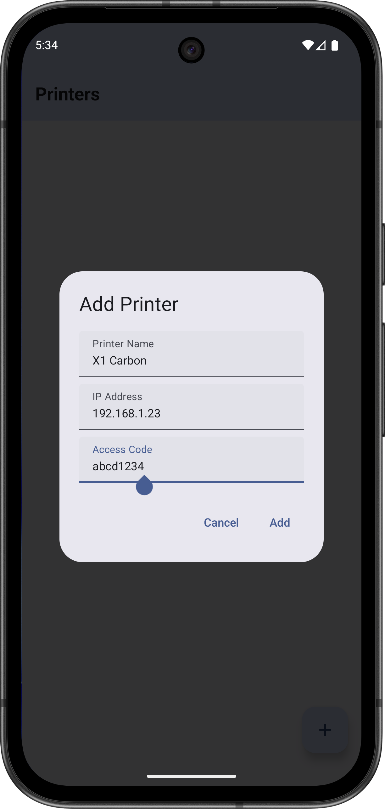

# OpenHand

Android application for interacting with Bambu Lab 3D printers via LAN.

OpenHand has been tested on a Bambu Lab X1 Carbon running [X1Plus](https://github.com/X1Plus/X1Plus) 
custom firmware but should work on any Bambu Lab X1 series printer that has been configured for LAN access. 

**Other Bambu Lab printer models are not supported yet.**

  

## Features

- Printer status monitoring
- Live view camera feed

#### Coming Soon

- File management
- Release on F-Droid
- P1 and A1 series support

## References

The following projects were referenced during the development of OpenHand:
- [Bambu-Connect](https://github.com/mattcar15/bambu-connect)
- [BambUI](https://github.com/fidoriel/BambUI)
- [OpenBambuAPI](https://github.com/Doridian/OpenBambuAPI)

The OpenHand icon is based on Google's wrist icon:
- [Wrist icon](https://fonts.gstatic.com/s/i/short-term/release/materialsymbolsoutlined/wrist/default/24px.xml)
